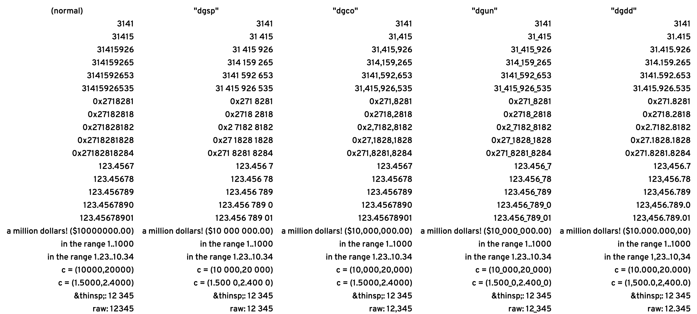

# Numderscore

Allows the rendering of digit grouping (thousand separators) in contexts where
you have some control over the font but don't want to (or can't) edit the text
inline.  It looks a bit like this:



This is achieved by adding font features to font files which enable outboard
configuration of number formatting. The 'inserted' characters are baked into the font, so they don't affect copy/paste, syntax highlighting, etc.

Attribution: This project is primarily [`sh1boot`'s `numderspace`](https://github.com/sh1boot/numderline), which is based substantially on Tristan Hume's [Numderline](https://thume.ca/numderline/) ([repo](https://github.com/trishume/numderline)). My (paulirish's) updates are adding `dgun`, auto-monospace detection, better test page and docs.

| Feature Name | Example | *D*igit *G*rouping with… |
| :--- | ---: | :--- |
| `dgsp` | `125 603.1415965` | **spaces** within whole numbers |
| `dgco` | `125,603.1415965` | **commas** within whole numbers |
| `dgun` | `125_603.141_596_5` | **underscores** within whole numbers and decimals |
| `dgdo` | `125.603,1415965` | **dots** within whole numbers (and replacing literal dot with comma, use with caution) |
| `dgdd` | `125.603,141.596.5` | **dots** within whole numbers and decimals (and replacing literal dot with comma, use with caution) |

## Usage: Patch the font
Patch a font to add the extra stuff:

```sh
python3 patcher.py SomeFont.ttf

python3 patcher.py --help # see available options 
```

## Usage: Apply the features

If you have [CSS control with `font-feature-settings`](https://developer.mozilla.org/en-US/docs/Web/CSS/font-feature-settings) over the font, apply this to the selectors you want formatted as such:

```CSS
font-feature-settings: 'dgsp';
```


Various editors/tools allow enabling these font-features; see https://github.com/tonsky/FiraCode/wiki/How-to-enable-stylistic-sets (just change `ss01` to `dgsp`, etc.)

To use it in a terminal (if you have one which supports ligation), you can use
a monospaced font and pass `--monospace` to the patcher so that it will
squeeze glyphs appropriately.

Usage might be configured with a line like: `font=My Font with DigitGrouping:fontfeatures=dgsp`
or `font_features My-Font-with-DigitGrouping dgsp`, or, in fontconfig:

```xml
    <match target="pattern">
         <test name="family" compare="contains"><string>DigitGrouping</string></test>
         <edit name="fontfeatures" mode="append">
             <string>dgsp</string>
         </edit>
     </match>
```

### Bake in grouping by default

Or… if all of that is too much hassle or isn't working out right, just bake
in `dgsp` as the default, by passing `--feature-name=calt` to the patcher.
